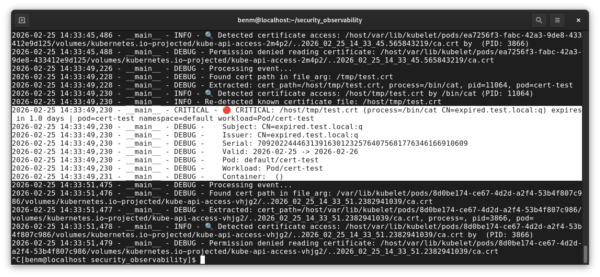

# Pod Enrichment Testing Guide



## Overview

This guide walks through testing the Kubernetes pod enrichment feature of the cert-analyzer, which enriches expired certificate detection events with full workload context — pod name, namespace, and owning workload (Deployment, DaemonSet, StatefulSet).

The test scenario works as follows:

1. A test pod accesses an expired certificate
2. Tetragon intercepts the file access via eBPF and emits a gRPC event
3. cert-analyzer receives the event, queries the Kubernetes API to look up the pod
4. The enriched log output and Prometheus metrics show the full workload context alongside the certificate details

---

## Prerequisites

- RHEL9 host with kernel 5.x+ and BTF enabled (`ls /sys/kernel/btf/vmlinux`)
- `kind` installed
- `helm` installed
- `kubectl` installed
- cert-analyzer image built locally (see main README for build steps)
- `k8s_enricher.py` integrated into `cert_analyzer.py` (see integration diff in `k8s_enricher.py`)
- `FILTER_SELF_EVENTS=false` set in `deployment.yaml` env vars if you also want to observe the cert-analyzer detecting its own certificate accesses

### Rootless Podman: systemd Delegation

kind uses Podman on RHEL9 and requires systemd cgroup delegation to be enabled for your user before it can create a cluster. Without this you will see:

```
ERROR: failed to create cluster: running kind with rootless provider requires
setting systemd property "Delegate=yes"
```

To fix this, run the following once and then **log out and back in completely** (a new terminal is not sufficient — a full session logout is required):

```bash
sudo mkdir -p /etc/systemd/system/user@.service.d
sudo tee /etc/systemd/system/user@.service.d/delegate.conf <<EOF
[Service]
Delegate=yes
EOF
sudo systemctl daemon-reload
```

Alternatively, if you prefer to avoid the logout you can run kind as root throughout. Since `kind` is typically installed per-user and not available on the system path, first install it system-wide so `sudo` can find it:

```bash
sudo install $(which kind) /usr/local/bin/kind
```

Then prefix all `kind` and `kubectl` commands in this guide with `sudo`, and copy the generated kubeconfig to your user after cluster creation:

```bash
sudo /usr/local/bin/kind get kubeconfig --name cert-monitor > ~/.kube/config
```

---

## Steps

### 1. Create a kind Cluster

```bash
sudo /usr/local/bin/kind create cluster --name cert-monitor
```

Copy the kubeconfig to your user so subsequent `kubectl` commands work without sudo:

```bash
sudo /usr/local/bin/kind get kubeconfig --name cert-monitor > ~/.kube/config
```

Verify the cluster is up:

```bash
kubectl cluster-info --context kind-cert-monitor
kubectl get nodes
```

NB. If you receive dial tcp connection refused errors then it's likely you are not running these steps for the first time in which case start the control plane:

```bash
sudo docker start cert-monitor-control-plane
```

### 2. Load the cert-analyzer Image

kind uses its own internal image store so rather than pushing to a registry you load the image directly:

```bash
sudo /usr/local/bin/kind load docker-image cert-analyzer:latest --name cert-monitor
```

Verify the image loaded successfully by checking the images available inside the kind node:

```bash
sudo docker exec cert-monitor-control-plane crictl images | grep cert-analyzer
```

You should see `cert-analyzer` listed with the `latest` tag.

### 3. Deploy Tetragon

NB. If you've previously installed Tetragon then skip the Tetragon installation steps below and instead simply:

```bash
sudo /usr/local/bin/kind get kubeconfig --name cert-monitor > ~/.kube/config
```

You should see output such as:

```bash
kubectl cluster-info --context kind-cert-monitor
enabling experimental podman provider
Kubernetes control plane is running at https://127.0.0.1:33821
CoreDNS is running at https://127.0.0.1:33821/api/v1/namespaces/kube-system/services/kube-dns:dns/proxy

To further debug and diagnose cluster problems, use 'kubectl cluster-info dump'.
```

You can verify your (pre-installed) Tetragon is running:

```bash
kubectl get pods -n kube-system -l app.kubernetes.io/name=tetragon
```

You should see output like:

```bash
NAME             READY   STATUS    RESTARTS      AGE
tetragon-w5qk7   2/2     Running   2 (10m ago)   47h
[benm@localhost security_observability]$ 

```

#### Tetragon Installation Steps

If helm is not already installed, install it first (it is not available via dnf on RHEL9):

```bash
curl https://raw.githubusercontent.com/helm/helm/main/scripts/get-helm-3 | bash
```

Verify:

```bash
helm version
```

Then add the Cilium repo and install Tetragon, configuring the gRPC server to expose a Unix socket on the host path so the cert-analyzer can connect to it:

```bash
helm repo add cilium https://helm.cilium.io
helm install tetragon cilium/tetragon -n kube-system --wait \
  --set tetragon.grpc.address="unix:///var/run/cilium/tetragon/tetragon.sock"
```

By default Tetragon binds its gRPC server to `localhost:54321` inside the pod, which is not reachable from other pods. The `--set` flag above tells Tetragon to instead expose the gRPC server as a Unix socket on the node host path, which the cert-analyzer mounts and connects to.

Verify Tetragon is running and the socket was created on the node:

```bash
kubectl get pods -n kube-system -l app.kubernetes.io/name=tetragon
sudo docker exec cert-monitor-control-plane ls /var/run/cilium/tetragon/
```

You should see both `tetragon.log` and `tetragon.sock` in that directory. If only `tetragon.log` is present the gRPC socket was not created — re-run the helm upgrade with the `--set` flag above.

Check Tetragon logs for any eBPF load errors:

```bash
kubectl logs -n kube-system -l app.kubernetes.io/name=tetragon -c tetragon
```

Look for any eBPF load errors. If Tetragon fails to load eBPF programs the cert-analyzer will connect but receive no events.

### 4. Load the Tetragon Tracing Policies

These tell Tetragon what to intercept. Without them no certificate access events will be emitted.

Note: `certificate-file-access.yaml` and `openssl-cert-load.yaml` in the original repo are not compatible with the current version of Tetragon. Updated versions are provided as `-v2` files. The original files are left untouched to avoid disrupting the existing demo.

```bash
kubectl apply -f tetragon-policies/certificate-file-access-v2.yaml
kubectl apply -f tetragon-policies/openssl-cert-load-v2.yaml
kubectl apply -f tetragon-policies/tls-service-tracking.yaml
```

Verify they loaded:

```bash
kubectl get tracingpolicies
```

You should see `certificate-file-access-v2` listed. Note that in a kind environment:

- `tls-service-tracking` will be created but fail to load — the `sockaddr` selector syntax has changed in the current Tetragon version. This policy is not required for the cert expiry demo.
- `openssl-cert-load-v2` will fail to load — the kind node does not have `libssl.so.3` at the expected paths. This is also non-critical as `certificate-file-access-v2` (which monitors file access via `fd_install`) is sufficient for the demo.

`certificate-file-access-v2` is the critical policy and is confirmed working.

### 5. Deploy cert-analyzer

```bash
kubectl apply -f kubernetes/deployment.yaml
```

Verify the pod is running:

```bash
kubectl get pods -n kube-system -l app=cert-expiry-monitor
```

Check the analyzer connected to Tetragon successfully:

```bash
kubectl logs -n kube-system -l app=cert-expiry-monitor
```

You should see:

```
Connected to Tetragon, listening for certificate events...
Kubernetes enricher: loaded in-cluster config
```

### 6. Watch the cert-analyzer Logs

In a dedicated terminal, tail the cert-analyzer logs so you can observe events in real time:

```bash
kubectl logs -n kube-system -l app=cert-expiry-monitor -f
```

### 7. Run the Test Pod

The cert-analyzer mounts the node's root filesystem at `/host`, so it can only read certificate files that exist on the node filesystem — not inside other containers. To make the test certificate visible to the cert-analyzer, first create it directly on the kind node:

```bash
sudo docker exec cert-monitor-control-plane sh -c "openssl req -x509 -newkey rsa:2048 -nodes \
  -keyout /tmp/test.key \
  -out /tmp/test.crt \
  -days 1 \
  -subj '/CN=expired.test.local'"
```

Then run the test pod mounting the node's `/tmp` as a hostPath volume so it can access the certificate:

```bash
kubectl delete pod cert-test --ignore-not-found
kubectl run cert-test \
  --image=alpine \
  --restart=Never \
  --overrides='{"spec":{"volumes":[{"name":"host-tmp","hostPath":{"path":"/tmp"}}],"containers":[{"name":"cert-test","image":"alpine","command":["sh","-c","while true; do cat /tmp/test.crt; sleep 5; done"],"volumeMounts":[{"name":"host-tmp","mountPath":"/tmp"}]}]}}'
```

---

## Expected Output

In the cert-analyzer log terminal you should see output similar to the following for each event:

```
2026-02-25 14:35:04,316 - __main__ - CRITICAL - 🔴 CRITICAL: /host/tmp/test.crt (process=/bin/cat CN=expired.test.local:q) expires in 1.0 days | pod=cert-test namespace=default workload=Pod/cert-test
2026-02-25 14:35:04,316 - __main__ - DEBUG -    Subject: CN=expired.test.local:q
2026-02-25 14:35:04,316 - __main__ - DEBUG -    Issuer: CN=expired.test.local:q
2026-02-25 14:35:04,316 - __main__ - DEBUG -    Serial: 709202244463139163012325764075681776346166910609
2026-02-25 14:35:04,317 - __main__ - DEBUG -    Valid: 2026-02-25 -> 2026-02-26
2026-02-25 14:35:04,317 - __main__ - DEBUG -    Pod: default/cert-test
2026-02-25 14:35:04,317 - __main__ - DEBUG -    Workload: Pod/cert-test
2026-02-25 14:35:04,317 - __main__ - DEBUG -    Container:  ()
```

And in the Prometheus metrics (accessible at `http://localhost:9090/metrics` via port-forward):

```bash
kubectl port-forward -n kube-system svc/cert-expiry-monitor 9090:9090
curl -s http://localhost:9090/metrics | grep tls_certificate_expiry_days
```

You should see labels including `pod_name`, `namespace`, `workload_kind`, `workload_name`, and `container_name` alongside the certificate path and expiry details.

---

## Troubleshooting

**No events appearing in cert-analyzer logs**
- Verify Tetragon is running: `kubectl get pods -n kube-system -l app.kubernetes.io/name=tetragon`
- Verify tracing policies loaded: `kubectl get tracingpolicies`
- Check Tetragon logs for eBPF errors: `kubectl logs -n kube-system -l app.kubernetes.io/name=tetragon`

**Pod context missing from log output (no pod_name in logs)**
- Verify the Kubernetes enricher initialised: check cert-analyzer logs for `Kubernetes enricher: loaded in-cluster config`
- Verify RBAC is applied: `kubectl get clusterrolebinding cert-expiry-monitor-pod-reader`
- Verify the `kubernetes` Python package is in `requirements.txt` and was included in the image build

**cert-test pod events not appearing (self-event filter)**
- If you are testing the cert-analyzer detecting its own certificate accesses, ensure `FILTER_SELF_EVENTS=false` is set in `deployment.yaml`

**eBPF not loading in kind**
- kind runs nodes as containers and eBPF availability depends on the host kernel exposing the necessary capabilities
- Verify BTF is available on the host: `ls /sys/kernel/btf/vmlinux`
- Check the kind node has access to `/sys/kernel/btf`: `docker exec cert-monitor-control-plane ls /sys/kernel/btf/vmlinux`

---

## Teardown

```bash
# Delete the test pod if still running
kubectl delete pod cert-test

# Tear down the kind cluster entirely
sudo /usr/local/bin/kind delete cluster --name cert-monitor
```
