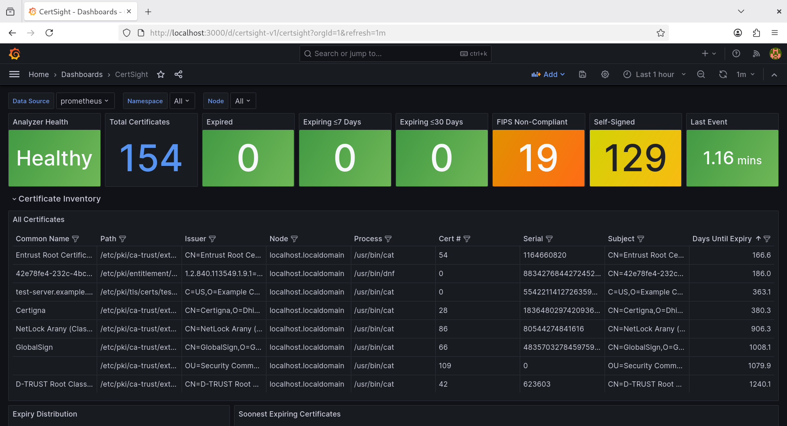

<p align="center">
  
</p>

# CertSight - Realtime certificate monitoring via eBPF


CertSight provides real-time certificate observability for Linux via eBPF without private keys, CA impersonation, or application changes in **cloud native, bare metal and openshift / k8s environments.**

**Live AWS demo:** [Dashboard](http://certsight-demo.com:3000/d/certsight-v1) · [Test console](http://certsight-demo.com:8090)

---

## The problem

Certificate expiry causes outages that are entirely preventable. At scale with hundreds of machines and thousands of certificates tracking what's actually running in your estate is hard, especially when certificates are loaded dynamically, passed in memory between TLS stack components, or processed by runtimes that never call system crypto libraries.

Furthermore on 15th March 2026 SSL certificate validity dropped to 200 days and in 2029 it will drop to just 47 days strengthening the case for always-on low overhead real time certificate monitoring.

## How CertSight differs from existing approaches

| Approach | What it sees | What it misses |
|---|---|---|
| Network scanner | Certs on open ports | In-memory certs, internal services, file-only loads |
| Binary scanner | Vulnerable components in artefacts at build time | Runtime execution paths, dynamically loaded certs |
| Scheduled filesystem scan | File-backed certs | In-memory certs, blind spots between scans |
| **CertSight** | • Every certificate file access system-wide <br>• In-memory certificates post-handshake <br>• Dynamically linked crypto <br>• Java certificate operations in both FIPS and non-FIPS environments (verified on Java 11, 17, and 21) <br>• Certs on open ports via optional port probe (triggered by bind events, no port sweep required) <br>• Remote server certificates via outbound connect probe (triggered by `tcp_connect` to TLS ports, no configuration required) <br><br> Every cert access is FIPS compliance checked with full process and k8s context surfaced <br><br> Extracts an extensive set of surfaced fields and metrics per certificate access. Refer to our [surfaced fields guide](extras/FIELDS-README.md) or our [Kafka schema](https://github.com/bensanmorris/security_observability/blob/main/extras/FIELDS-README.md#kafka-event-schema) <br><br> Also ships with a [Grafana dashboard](extras/DASHBOARDS.md) and a [test console](extras/test-server/TEST-SERVER-README.md) | Statically linked crypto (excluding Java / JCA - we've got that covered) |

An application is not a single binary. It is a tree of executables and shared libraries (and kernel activity) where each node may have its own dependencies. A binary scanner inventories each node in isolation. An exploit may target a specific branch of that tree that the scanner considers clean. CertSight observes what is actually executing and performing certificate operations at runtime, irrespective of where in the dependency tree that activity originates.

## What CertSight detects

- Every certificate file access system-wide via eBPF fd_install kprobe (PEM, DER, JKS, PKCS12)
- In-memory certificates post-handshake via OpenSSL and NSS uprobes (no private keys required)
- TLS endpoints discovered via bind events — triggers a TLS handshake against the bound address/port and [ingests the served certificate](https://github.com/bensanmorris/security_observability/releases/tag/v0.47), along with the negotiated TLS protocol version and cipher suite
- Remote server certificates discovered via outbound `tcp_connect` events to common TLS ports (443, 8443, 5671, 6380, 9093, …) — makes remote server expiry visible without any per-service configuration, along with the negotiated TLS protocol version and cipher suite
- Java certificate operations in both FIPS and non-FIPS environments via our Java JCA instrumentation agent + JNI to eBPF bridge
- Which process accessed which certificate, when, and from which Kubernetes pod
- An extensive set of surfaced fields and metrics per certificate access. Refer to our [surfaced fields guide](extras/FIELDS-README.md) or our [Kafka schema](https://github.com/bensanmorris/security_observability/blob/main/extras/FIELDS-README.md#kafka-event-schema)

Instructions are below but if you prefer to watch video guides:

- [CertSight - Installation & Operation](https://youtu.be/9QpfuU0TKec)
- [CertSight - Dashboard demo](https://youtu.be/oe7yznJaDTM)



---

## Prerequisites

- Linux x86_64, kernel >= 4.18 (for eBPF kprobe / uprobe support)
- [Tetragon](https://tetragon.io) installed and running (for policy-based eBPF hooking support)

---

## Installation

Download the RPM from the [latest release](../../releases/latest).

```bash
sudo dnf install ./cert-analyzer-<version>.el9.x86_64.rpm   # RHEL 9
sudo dnf install ./cert-analyzer-<version>.el8.x86_64.rpm   # RHEL 8
```

The installer will fail with a clear error if Tetragon is not found.

**Applying our certificate-related Tetragon policies:**

| Policy | Purpose | RHEL |
|---|---|---|
| `certificate-file-access.yaml` | Detects certificate file opens by process (`.pem`, `.crt`, `.jks`, `.p12`, etc.) | 8 and 9 |
| `tls-service-tracking-fixed.yaml` | Identifies processes binding on TLS-capable ports (nginx, httpd) via `sys_bind` — used with `port_probe` to ingest the served certificate | 8 and 9 |
| `tcp-connect-tls.yaml` | Fires on outbound `tcp_connect` calls to common TLS ports (443, 636, 8443, 5671, 5672, 6380, 8883, 9093, 9094) — used with `port_probe` to probe remote server certificate expiry without any per-service configuration. **If you add or remove ports from the `DPort` filter in this policy you must also update `tls_outbound_ports` in `cert-analyzer.conf` to match** — the policy filters events at the kernel boundary; cert-analyzer applies the same list as a Python-side guard | 8 and 9 |
| `experimental/openssl1_1-cert-load.yaml` | Intercepts in-memory certificate loads via OpenSSL 1.1 (`libssl.so.1.1`) | 8 only |
| `experimental/openssl3-cert-load.yaml` | Intercepts in-memory certificate loads via OpenSSL 3 (`libssl.so.3`) | 9 only |
| `experimental/java-fips-nss-cert.yaml` | Intercepts certificate objects created via NSS/PKCS11 (FIPS-mode JVMs) | 9 only |
| `experimental/java-non-fips-cert.yaml` | Intercepts certificates exported via the Java cert-agent native stub | 8 and 9 |
| `experimental/tls-service-tracking.yaml` | Identifies TLS service binds using Tetragon's `Protocol` selector (requires Tetragon ≥ v1.4) | 8 and 9 |

Policies are not bundled in the RPM — they are shipped separately so they can be updated independently of the agent. Each CI run and release attaches a `tetragon-policies-<version>.tar.gz` artifact containing all policy YAMLs (including those under `experimental/`).

```bash
tar -xzf tetragon-policies-<version>.tar.gz

# Detects your RHEL version, loads all appropriate policies, and persists
# them to /etc/tetragon/tetragon.tp.d/ so they survive Tetragon restarts:
sudo ./tetragon-policies/apply-policies.sh
```

> **Note:** `experimental/java-fips-nss-cert.yaml` hooks `NSC_CreateObject` and `NSC_FindObjectsInit` inside `libsoftokn3.so`. These symbols are not exported in the stripped RHEL package, so Tetragon resolves them via build-ID debuginfo lookup. Install the debuginfo package before loading this policy or the uprobe will fail to attach:
> ```bash
> sudo dnf debuginfo-install nss-softokn
> ```

**(Optional) Java agent (non-FIPS JVMs):**

For JVMs running without FIPS mode, install the two Java agent RPMs from the [latest release](../../releases/latest) and enable the deployer service:

```bash
sudo dnf install ./cert-agent-jni-<version>.el9.x86_64.rpm
sudo dnf install ./cert-agent-deployer-<version>.el9.x86_64.rpm
sudo systemctl enable --now cert-agent-deployer
```

The deployer scans `/proc` every 30 seconds and uses `jattach` to inject `cert-agent.jar` into each new JVM it finds. The RPM automatically installs and loads a bundled SELinux policy module (`cert_agent_deployer`) that grants the permissions jattach requires (ptrace, signal, `/proc` reads, `/tmp` socket access). The `experimental/java-non-fips-cert.yaml` policy is included in `apply-policies.sh` — if you have already run it, no additional step is needed. The uprobe is installed on the `libcert_agent_stub.so` file inode, so it fires for any JVM that subsequently loads the library with no ordering constraint relative to the deployer.

**Verifying with the probe-tests archive:**

The `probe-tests-<version>.tar.gz` artifact (attached to each release) includes `CertAgentTest` — a small program that continuously loads certificates into a JCA `KeyStore`, giving the uprobe a repeating target to fire on.

```bash
tar -xzf probe-tests-<version>.tar.gz

# Start the test program (loads a cert every 5 s, runs until killed)
# Pass any PEM/DER certificate — e.g. one from your existing PKI or /etc/ssl
java -cp java CertAgentTest /path/to/cert.pem &

# Wait for the deployer to attach — confirm with:
sudo journalctl -u cert-agent-deployer -f

# If the deployer logs "Could not dynamically attach" (e.g. on systems where the
# bundled SELinux module has not yet taken effect), attach manually as a one-off:
sudo jattach <pid> load instrument false \
    /opt/cert-agent/cert-agent.jar=/opt/cert-agent/libcert_agent_stub.so

# Confirm detection in cert-analyzer:
sudo journalctl -u cert-analyzer -f | grep java_cert_agent_write
```

See [probe_tests/README.md](probe_tests/README.md#cert-agent-java-non-fips) for the full test procedure and static-agent injection alternative.

---

## Post-install

The RPM installs a systemd drop-in that grants cert-analyzer access to the Tetragon socket. Restart Tetragon to apply it:

```bash
sudo systemctl restart tetragon
```

Edit the config file, then start the service:

```bash
sudo vim /etc/cert-analyzer/cert-analyzer.conf
sudo systemctl enable --now cert-analyzer
```

---

## Configuration

`/etc/cert-analyzer/cert-analyzer.conf` — preserved across upgrades.

**[tetragon]**

| Setting | Default | Description |
|---|---|---|
| `addr` | `unix:///run/tetragon/tetragon.sock` | Tetragon gRPC address |
| `version_check_interval` | `300` | Seconds between Tetragon version checks |

**[metrics]**

| Setting | Default | Description |
|---|---|---|
| `port` | `9090` | Prometheus metrics port |
| `event_rate_metrics_enabled` | `false` | Track `tcp_connect` and socket-bind event counts per process as Prometheus counters (`tls_tcp_connect_events_total`, `tls_socket_bind_events_total`). Useful for identifying which application is driving probe load spikes. Disabled by default to avoid high label cardinality in environments with many distinct process names |

**[health]**

| Setting | Default | Description |
|---|---|---|
| `port` | `8086` | Liveness (`/healthz`) and readiness (`/readyz`) probe port |
| `readiness_grace_period_seconds` | `60` | Seconds after startup before readiness checking begins |
| `readiness_staleness_seconds` | `300` | Max age of last event before pod is marked not-ready |

**[alerting]**

| Setting | Default | Description |
|---|---|---|
| `threshold_days` | `30` | Days before expiry at which to emit warning-level log output |

**[scanning]**

| Setting | Default | Description |
|---|---|---|
| `paths` | `/etc/ssl,/etc/pki` | Optional comma-separated directories for optional periodic certificate scanning. Scanning is disabled if empty |
| `interval_seconds` | `3600` | Seconds between periodic scans |

**[logging]**

| Setting | Default | Description |
|---|---|---|
| `level` | `INFO` | `DEBUG`, `INFO`, `WARNING`, `ERROR`, `CRITICAL` |

**[cache]**

| Setting | Default | Description |
|---|---|---|
| `max_size` | `10000` | LRU cache size for known certs (minimum 10,000) |

**[certificates]**

| Setting | Default | Description |
|---|---|---|
| `checksum_enabled` | `false` | Compute SHA-256 fingerprints per certificate |
| `fips_compliance_enabled` | `true` | Check each certificate for FIPS 140-2/140-3 algorithm compliance (key type, minimum key size, approved curves, signature hash) |
| `filter_self_events` | `true` | Ignore certificate accesses made by the analyzer itself |
| `host_prefix` | _(empty)_ | Path prefix prepended to certificate paths from Tetragon events — leave empty for bare metal, set to `/host` for Kubernetes |
| `demo_mode` | `false` | Log certificate details (subject, issuer, serial, validity, SANs) at INFO level instead of DEBUG — for demos only, leave false in production |
| `large_file_cert_threshold` | `20` | Files with more PEM certs than this (e.g. a system CA bundle) are parsed on a background thread instead of the Tetragon event-consumer thread |
| `large_file_metrics_cap` | `300` | Caps how many certs in a single bundle file get full Prometheus metrics/logging, independent of `large_file_cert_threshold` above. Certs beyond the cap are still cached internally and still published to Kafka if enabled, just not tracked as individual Prometheus series. Default comfortably covers a real system CA trust bundle (~130-150 certs) |
| `large_file_byte_cap` | `2097152` (2MB) | Caps how many bytes are read to decide whether a file is "large" (see `large_file_cert_threshold` above). Without this, that check reads the entire file up front on the Tetragon event-consumer thread before any background-thread dispatch decision is made. Default comfortably covers real-world CA trust bundles (a few hundred KB in practice) while bounding the worst case for an oversized or degenerate file |
| `max_concurrent_background_threads` | `20` | Caps how many TLS-probe / large-file-parse background threads can run at once, so a burst of events (e.g. many pods reconnecting to dependencies after a restart) can't spawn unbounded OS threads. Events beyond the cap are dropped and retried on a later qualifying event rather than queued |
| `max_processes_per_cert` | `20` | Caps how many distinct `(process, parent_process)` pairs get their own `tls_certificate_process_info` series per certificate. Without this, a file opened by many unrelated binaries over the life of the process (e.g. the system CA trust bundle touched by curl, dnf, git, python, docker, ...) accumulates one permanent series per distinct process, forever, regardless of cache size. The certificate's own expiry/FIPS/self-signed metrics and Kafka discovery event are unaffected — only this per-process attribution axis is capped |

**[passwords]**

| Setting | Default | Description |
|---|---|---|
| `jks_password` | _(unset)_ | Password tried when opening encrypted JKS keystores |
| `pkcs12_password` | _(unset)_ | Password tried when opening encrypted PKCS12 keystores |

**[port_probe]**

| Setting | Default | Description |
|---|---|---|
| `bind_probe_enabled` | `false` | Enable inbound TLS probing. Bind events from `tls-service-tracking-fixed.yaml` trigger a TLS handshake against the newly bound address/port and ingest the served certificate. Low event volume — safe to enable broadly. Each unique `host:port` is probed at most once (O(1) dedup). The handshake also captures the negotiated TLS protocol version and cipher suite (`tls_certificate_negotiated_protocol`) — no separate flag needed |
| `connect_probe_enabled` | `false` | Enable outbound TLS probing. `tcp_connect` events from `tcp-connect-tls.yaml` to common TLS ports trigger an immediate probe against the remote server, making remote certificate expiry visible without per-service configuration. Each unique `host:port` is probed at most once (O(1) dedup); enable with care on hosts with high outbound connection rates. The handshake also captures the negotiated TLS protocol version and cipher suite (`tls_certificate_negotiated_protocol`) — no separate flag needed |
| `tls_outbound_ports` | _(built-in list)_ | Comma-separated list of destination ports to treat as TLS for outbound connect probing. Defaults to `443,636,5671,5672,6380,8443,8883,9093,9094`. If you add or remove ports, you must also update the `DPort` filter in `tcp-connect-tls.yaml` — the Tetragon policy filters events at the kernel boundary; this list is the Python-side guard. Both must agree |
| `connect_delay_seconds` | `2` | Seconds to wait after a bind event before probing, to allow TLS initialisation to complete (applies to `bind_probe_enabled` only — outbound probes fire immediately) |
| `timeout_seconds` | `5` | Seconds before a TLS probe connection attempt times out |

**[kafka]**

| Setting | Default | Description |
|---|---|---|
| `enabled` | `false` | Publish certificate discovery events to Kafka |
| `bootstrap_servers` | `localhost:9092` | Comma-separated broker addresses |
| `topic` | `cert-analyzer-events` | Topic to publish events to |
| `security_protocol` | `PLAINTEXT` | `PLAINTEXT`, `SSL`, `SASL_PLAINTEXT`, `SASL_SSL` |
| `sasl_mechanism` | _(unset)_ | SASL mechanism — required for `SASL_*` protocols |
| `sasl_username` | _(unset)_ | SASL username |
| `sasl_password` | _(unset)_ | SASL password |

---

## Verify

```bash
sudo systemctl status cert-analyzer
sudo journalctl -u cert-analyzer -f

# Metrics
curl -s http://localhost:9090/metrics | grep tls_certificate_expiry_days
```

## Further reading

- [OpenShift deployment guide](extras/OPENSHIFT-DEPLOYMENT-README.md) - SCC bindings and manifest changes needed on OpenShift
- [Linux capabilities reference](linux-capabilities.md) - Required Linux capabilities for each component
- [Uprobe hook tests](probe_tests/README.md) - Programs for verifying Tetragon uprobe policies fire correctly
- [Performance tests](perf_tests/README.md) - Throughput and latency comparison across cert-analyzer configurations
- [Surfaced fields reference](extras/FIELDS-README.md) - All Prometheus metrics and Kafka event fields
- [Grafana dashboard](extras/DASHBOARDS.md) - Setup guide and dashboard section reference
- [Roadmap](extras/ROADMAP.md) - Planned and proposed improvements
- [Presentation Q&A](extras/PRESENTATION-QA.md) - Questions and answers covering architecture, deployment, Java JCA/JNI hooking, and roadmap
- [Local Kafka testing](extras/kafka/KAFKA-README.md) - Install a throwaway Kafka broker and view published events
- [Detection test console](extras/test-server/TEST-SERVER-README.md) - Local web UI for triggering individual certificate detections and watching the resulting Kafka events live
- [AWS deployment demo](extras/aws-demo/README.md) - Stand up the full CertSight stack on a single EC2 instance with public dashboard and test console URLs
