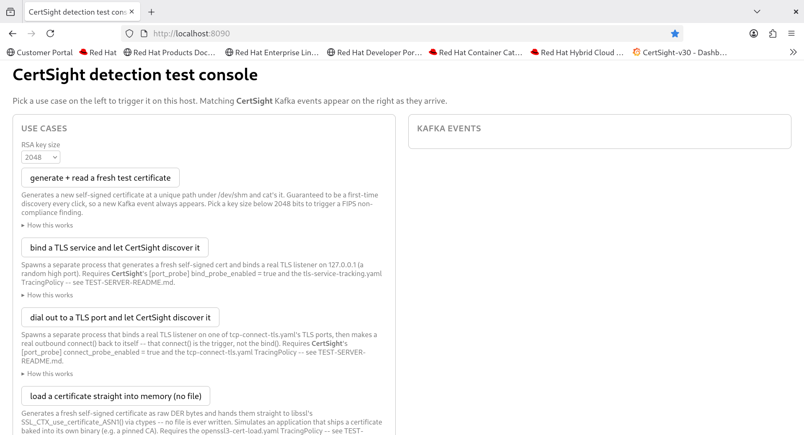

# CertSight detection test console

A small local HTTP server for manually exercising CertSight's certificate
detections one at a time and watching the resulting Kafka event show up
live, without needing a second terminal for `kafka-console-consumer.sh` or
juggling `cat`/`openssl` commands by hand.

**Left pane:** a list of test use cases (e.g. "generate + read a fresh test
certificate", "bind a TLS service and let CertSight discover it"). Clicking
one runs the underlying action for real on this host -- a real file read, a
real TLS handshake, etc. -- so Tetragon and cert-analyzer pick it up exactly
as they would in production.

**Right pane:** every message cert-analyzer publishes to its Kafka topic,
streamed live via Server-Sent Events as it arrives.



---

## Prerequisites

- Tetragon + cert-analyzer already installed, running, and configured with
  the certificate-file-access policy applied (see the main
  [README](../../README.md#installation)) -- required for the
  "generate + read a fresh test certificate" use case
- cert-analyzer configured with `[kafka] enabled = true` and pointed at a
  reachable broker -- see [extras/kafka/KAFKA-README.md](../kafka/KAFKA-README.md)
  to stand up a throwaway local broker
- Python 3.9+ (a virtualenv install) or `python3.11` (an RPM install) on
  the target host -- see "Install" below for which
- Run this **on the same host** cert-analyzer is monitoring -- use cases
  shell out to real local commands (e.g. `cat`) or bind real local ports,
  so running it from a different machine won't trigger anything
- For the "bind a TLS service" use case specifically: cert-analyzer
  configured with `[port_probe] bind_probe_enabled = true`, and the
  `tls-service-tracking.yaml` TracingPolicy loaded (under
  `tetragon-policies/experimental/` -- despite what some other docs in
  this repo reference, `tls-service-tracking-fixed.yaml` doesn't actually
  exist yet; the experimental policy has no port/binary filter, so it
  fires on every bind() on the host, which is fine for local testing but
  worth knowing before loading it anywhere else)
- For the "dial out to a TLS port" use case specifically: cert-analyzer
  configured with `[port_probe] connect_probe_enabled = true`, and the
  `tcp-connect-tls.yaml` TracingPolicy loaded (under `tetragon-policies/`)
- For the "load a certificate straight into memory" use case specifically:
  the `openssl3-cert-load.yaml` (or `openssl3-cert-load-rhel8.yaml` on
  RHEL8) TracingPolicy loaded, and `/usr/lib64/libssl.so.3` present on
  this host -- that's the literal path both policies hook, and the one
  this use case loads via `ctypes`
- For the "Certificate blast radius explorer" link specifically: a
  reachable Prometheus scraping cert-analyzer's `/metrics` endpoint (see
  `--prometheus-url` / `TEST_SERVER_PROMETHEUS_URL` below) -- not required
  for anything else in this console

## Install

Two ways to get `cryptography`/`kafka-python` in place, depending on
whether the target host has pip/internet access.

### Option A: virtualenv (target host has pip/internet access)

```bash
cd extras/test-server
python3 -m venv .venv
source .venv/bin/activate
pip install -r requirements.txt
```

`requirements.txt` pins the same `cryptography`/`kafka-python` versions as
the main [requirements.txt](../../requirements.txt), so if you're already
running cert-analyzer's own virtualenv on this host, that one already
satisfies both and you can skip creating a separate one -- just `source`
that venv's `activate` instead.

### Option B: RPM (target host has no pip/internet access)

CI builds this RPM already, for both el8 and el9, with `cryptography` and
`kafka-python` bundled into a relocatable virtualenv at
`/opt/certsight-test-server/venv` -- no need to build it yourself. Grab
`certsight-test-server-*.el8*.rpm` / `*.el9*.rpm` from a tagged
[Release](../../releases) page, or -- for an untagged branch/PR -- from
the `build-test-server-rpm` job's artifacts on its
[Actions run](../../actions/workflows/build.yml) (also triggerable
on-demand via `workflow_dispatch`). Copy it to the
target host and install it with zero pip/internet access required there:

```bash
sudo dnf install ./certsight-test-server-<version>-<release>.el9.*.rpm
```

Only build it locally (`./build-rpm.sh --version 0.1.0 --release 1`) if
you need a change that hasn't been through CI yet. Run that on any machine
with normal pip/PyPI access -- it doesn't need to be the target host --
and it produces the same RPM under
`~/rpmbuild/RPMS/$(uname -m)/certsight-test-server-<version>-<release>.*.rpm`,
following the same pattern as `cert-analyzer.spec` (see there for why the
debuginfo/build-id suppression macros at the top of the spec are needed).

This installs a `certsight-test-server` wrapper onto `$PATH` that runs
`server.py` with the bundled venv's interpreter -- see "Run" below, just
without the `source .venv/bin/activate` step and using `certsight-test-server`
instead of `python3 server.py`. It also installs a
`certsight-test-server.service` systemd unit and a dedicated
`certsight-test-server` system user, so it can be left running across
reboots instead of started by hand every time -- see "Running under
systemd" below.

## Run

```bash
source .venv/bin/activate   # only if you used Option A; skip for the RPM install
python3 server.py --kafka-host localhost --kafka-port 9092   # or: certsight-test-server --kafka-host ... (RPM install)
```

(Adjust the path to `server.py` if running from the repo root instead of
`extras/test-server/`.)

Then open http://localhost:8090.

`--kafka-host`/`--kafka-port` are required (no baked-in default) since the
broker is whatever you configured cert-analyzer's `[kafka] bootstrap_servers`
to point at. `--topic` defaults to `cert-analyzer-events` (cert-analyzer's
own default); pass `--port` to change this server's own listen port
(default `8090`). `--prometheus-url` defaults to `http://127.0.0.1:9090`
(an IPv4 literal, not `localhost` -- see below) and only matters for the
"Certificate blast radius explorer" / "Certificate chain explorer" links --
adjust it if Prometheus lives elsewhere (env: `TEST_SERVER_PROMETHEUS_URL`).

If either link fails with `[Errno 97] Address family not supported by
protocol`, the host has IPv6 disabled at the kernel level (common on
hardened/STIG-compliant builds) and something got the default overridden
back to a `localhost` URL -- `getaddrinfo("localhost", ...)` can return only
the `::1` result on such a host, which fails immediately with no IPv4
fallback attempted. Point `--prometheus-url` / `TEST_SERVER_PROMETHEUS_URL`
at an explicit IPv4 address instead.

By default this only listens on `127.0.0.1`, so it's only reachable from a
browser on the same host. If the target host is headless and you're
browsing from elsewhere on a trusted lab network, pass `--bind 0.0.0.0` to
listen on all interfaces, then open `http://<target-host>:8090` instead of
`localhost`.

**Do not** bind this beyond localhost or a trusted lab network: every use
case executes a real, hardcoded action against this host on request from
any browser that can reach it.

## Certificate blast radius explorer

The "Certificate blast radius explorer" link in the header
(`blast_radius.py`) is generated live, on click, against Prometheus --
querying cert-analyzer's own `tls_certificate_expiry_days` and
`tls_certificate_process_info` metrics fresh each time rather than a
pre-baked snapshot. It shows every certificate cert-analyzer has
discovered, colored by expiry urgency; clicking one reveals every
distinct process/pod/node Tetragon has observed loading it, i.e. what
would actually break if that certificate were rotated or revoked.

Unlike the rest of this console it needs a reachable Prometheus, not just
Tetragon/cert-analyzer/Kafka -- see `--prometheus-url` /
`TEST_SERVER_PROMETHEUS_URL` above. If Prometheus is unreachable or has no
matching series yet, the link returns a plain-text error explaining why
instead of a broken page.

This is a bundled copy of the standalone
[`extras/cert_blast_radius.py`](../cert_blast_radius.py) script (same
rendering logic, trimmed to a library) -- see that file if you want to
generate a static HTML report without running this console at all.

## Certificate chain explorer

The "Certificate chain explorer" link (`chain_explorer.py`) is generated
live the same way, grouping cert-analyzer's `tls_certificate_expiry_days`
and `tls_certificate_self_signed` metrics by `cert_path` and ordering each
bundle by `cert_index` (0 = leaf) to show its chain length and
leaf/intermediate/root structure.

It separately flags a real misconfiguration: any non-self-signed cert in a
bundle whose issuer doesn't match any other cert's subject in that same
bundle -- the "server forgot to include its intermediate CA" case. Bundles
with a missing intermediate sort to the top of the overview. This mirrors
[`extras/kafka/list_cert_chains.py`](../kafka/list_cert_chains.py)'s
detection logic, but reads Prometheus's current live state instead of
replaying Kafka's first-time-discovery history, so it reflects every
bundle cert-analyzer currently knows about, not just what Kafka has seen
since it was enabled.

Also needs the reachable Prometheus described above (`--prometheus-url` /
`TEST_SERVER_PROMETHEUS_URL`); same plain-text-error behavior if it's
unreachable or has no data yet.

## Running under systemd (RPM install only)

The RPM installs `certsight-test-server.service`, enabled on install so it
starts on every boot, running as a dedicated unprivileged
`certsight-test-server` system user. Unlike the manual CLI (`--bind`
defaults to `127.0.0.1`), the unit binds `0.0.0.0` by default, since a
systemd-managed instance is typically left running on a headless lab host
that you browse to from elsewhere -- **only do this on a trusted lab
network behind a firewall**, per the warning above.

It has no working default for `--kafka-host`/`--kafka-port`, so it won't
actually come up until you configure it:

```bash
sudo vi /etc/certsight-test-server/test-server.conf   # set TEST_SERVER_KAFKA_HOST / TEST_SERVER_KAFKA_PORT
sudo systemctl start certsight-test-server
```

**If it was already enabled before you configured it** -- e.g. it tried to
start at boot, or you ran `systemctl start` before editing the conf file
-- it burns through all 5 restart attempts (`Restart=on-failure`,
`StartLimitBurst=5` in `StartLimitInterval=300`) in under a minute and
lands in a rate-limited `failed` state. `journalctl -u certsight-test-server`
will show the same "--kafka-host/--kafka-port are required" error
`server.py` gives on the CLI, followed by `Start request repeated too
quickly`. Editing the conf file alone won't fix this -- systemd won't
even attempt another start until the rate limit is cleared:

```bash
sudo vi /etc/certsight-test-server/test-server.conf   # set TEST_SERVER_KAFKA_HOST / TEST_SERVER_KAFKA_PORT
sudo systemctl reset-failed certsight-test-server
sudo systemctl start certsight-test-server
```

Check status/logs, or stop it, the usual way:

```bash
systemctl status certsight-test-server
journalctl -u certsight-test-server -f
sudo systemctl stop certsight-test-server      # sudo systemctl disable ... to also stop it starting on boot
```

`test-server.conf` is a systemd `EnvironmentFile` (shell `KEY=VALUE`), not
the same format as `cert-analyzer.conf` -- see the commented-out options
in the shipped file for the full list (`TEST_SERVER_KAFKA_HOST`,
`TEST_SERVER_KAFKA_PORT`, `TEST_SERVER_TOPIC`, `TEST_SERVER_PORT`,
`TEST_SERVER_BIND`, `TEST_SERVER_PROMETHEUS_URL`). It's marked
`%config(noreplace)` in the spec, so an RPM upgrade won't overwrite edits
you've made to it.

## Use cases

| Use case | Action | Detection exercised |
|---|---|---|
| generate + read a fresh test certificate | Generates a new self-signed cert at a unique path under `/dev/shm`, then `cat`s it | File-access detection via the `certificate-file-access.yaml` Tetragon policy (`fd_install` kprobe); pick an **RSA key size** below 2048 bits to also trigger a `fips_compliant=false` finding |
| bind a TLS service and let CertSight discover it | Spawns `tls_probe_helper.py` as a separate process, which generates its own self-signed cert and binds a real TLS listener on `127.0.0.1:<random high port>` | Inbound bind detection via the `tls-service-tracking.yaml` Tetragon policy (`security_socket_bind` LSM hook) plus cert-analyzer's `[port_probe]` TLS handshake probe |
| dial out to a TLS port and let CertSight discover it | Spawns `tcp_connect_probe_helper.py` as a separate process, which binds a real TLS listener on one of `tcp-connect-tls.yaml`'s TLS ports and then connects back to itself | Outbound connect detection via the `tcp-connect-tls.yaml` Tetragon policy (`tcp_connect` kprobe) plus cert-analyzer's `[port_probe]` TLS handshake probe |
| load a certificate straight into memory (no file) | Generates a fresh self-signed cert as DER bytes and calls `SSL_CTX_use_certificate_ASN1()` directly against the system libssl via `ctypes` -- no file is ever written | In-memory cert detection via the `openssl3-cert-load.yaml` Tetragon policy (`SSL_CTX_use_certificate_ASN1` uprobe); cert-analyzer builds a synthetic `uprobe://SSL_CTX_use_certificate_ASN1/<pid>/<serial>` path since there's no real one |
| load a certificate into a Java KeyStore (JCA) | Spawns a JVM (`CertAgentTest`), jattaches CertSight's cert-agent Java instrumentation into it, then watches it call `KeyStore.setCertificateEntry()` on a fresh in-memory cert every few seconds | In-memory JCA cert detection via the `java-non-fips-cert.yaml` Tetragon policy (`java_cert_agent_write` uprobe); cert-analyzer builds a synthetic `uprobe://java_cert_agent_write/<pid>/<serial>` path since there's no real file |

The RSA key size is selectable (1024/2048/3072/4096 bits) via a dropdown
next to the button, both in the UI and as a `{"key_size": "1024"}` JSON
body to `POST /api/run/fresh-test-cert`. cert-analyzer's FIPS checker
(`agent/fips_compliance_checker.py`) flags anything under 2048 bits, so
1024 reliably produces a `fips_compliant: false` / `fips_violations: [...]`
Kafka event; 2048 and up stay compliant. `key_size` is validated
server-side against that fixed set of options (`use_cases.py`'s
`_ALLOWED_KEY_SIZES`) rather than trusted as-is, since this endpoint has no
authentication and may be reachable from the whole lab network (see the
`--bind`/systemd warnings above) -- an arbitrary value could otherwise be
used to force an expensive keygen or an odd failure.

Note this only covers key-size violations, not weak signature hash
algorithms (MD5/SHA1): the `cryptography` library refuses to sign a
certificate with either outright (`UnsupportedAlgorithm`), and shelling
out to the `openssl` CLI instead is inconsistent across hosts depending on
their FIPS/crypto-policy state, so that option isn't offered here.

If FIPS mode is actually enforced at the OpenSSL provider level on the
host running this server, generating a sub-2048-bit RSA key can itself be
refused -- the use case surfaces that as a normal (if slightly ironic)
failure result rather than a crash.

Every click generates a brand-new cert at a brand-new path, so it's always
a first-time discovery from cert-analyzer's point of view (its known-certs
dedup key is `path:index:serial` -- see `agent/analyzer.py`) and always
produces a fresh Kafka event, unlike re-`cat`ing a real system file cert-
analyzer has already seen (Prometheus-only by design -- see
[extras/kafka/KAFKA-README.md](../kafka/KAFKA-README.md)).

Generated certs pile up under `/dev/shm/certsight-test-server/` -- cert-
analyzer never needs them again once processed, so it's safe to delete that
directory's contents by hand at any time. `/dev/shm` is used deliberately
instead of `/tmp`: cert-analyzer's systemd unit runs with `PrivateTmp=true`,
which gives it its own private `/tmp`/`/var/tmp` mount namespace that can't
see files written to the host's `/tmp`.

### What actually happens when you click it

The same step-by-step breakdown is shown in the UI itself, under each use
case's "How this works" disclosure -- reproduced here for reference:

1. This server generates a self-signed X.509 certificate in memory and
   writes it to a brand-new path under `/dev/shm/certsight-test-server/`.
2. This server runs `cat <path>` as a real subprocess -- a real process
   performing a real `open()`/`read()` of that file, no different from an
   admin or application reading a cert off disk.
3. When the kernel services that `open()`, it calls `fd_install()` to
   attach the new file descriptor to the `cat` process. Tetragon has a
   kprobe on `fd_install`, loaded system-wide via the
   `certificate-file-access.yaml` TracingPolicy.
4. That policy's selector matches the opened file's path against a list of
   certificate-like extensions (`.crt`, `.pem`, `.jks`, `.p12`, ...). The
   generated file ends in `.crt`, so the kprobe's selector matches and
   Tetragon emits a process/kprobe event over its gRPC stream.
5. cert-analyzer's Tetragon gRPC client -- already subscribed to that
   stream -- receives the event and extracts the file path and the process
   that opened it (`/usr/bin/cat`), logging `🔍 Detected certificate
   access`.
6. cert-analyzer independently opens and reads that same file itself (a
   second, separate real file read, from its own process) to parse the
   X.509 structure: subject, issuer, SAN, validity dates, key
   algorithm/size, FIPS compliance, etc.
7. Because this exact path has never been seen before, cert-analyzer's
   known-certs cache treats it as a first-time discovery: it records the
   cert, updates Prometheus metrics, and -- since `[kafka] enabled = true`
   -- publishes a `certificate_discovered` JSON event to the
   `cert-analyzer-events` Kafka topic.
8. This test server's own background Kafka consumer thread, subscribed to
   that same topic, receives the message and pushes it to every connected
   browser over the Server-Sent Events stream, where it lands in the
   right-hand pane.

### Permissions on the generated cert directory

No manual setup is required -- this all happens automatically -- but it's
worth knowing why it works: `/dev/shm` itself is world-writable with the
sticky bit set (`drwxrwxrwt`, same model as `/tmp`), so any user can create
`certsight-test-server/` under it without `sudo`. cert-analyzer, however,
runs as its own unprivileged `cert-analyzer` system user (see `User=` /
`Group=` in `cert-analyzer.service`), not as whoever runs this test server,
so it needs "other" read+execute on that directory and "other" read on
each generated cert file to open them at all. `use_cases.py` sets those
bits explicitly (`0o755` / `0o644`) after creating them rather than relying
on the calling user's umask, since a stricter umask (e.g. `077`, common on
hardened hosts) would otherwise silently produce files cert-analyzer can't
read -- Tetragon would still report the file access (its `fd_install`
kprobe doesn't care about DAC permissions), but cert-analyzer's own
follow-up read of the file content would fail, and no event would reach
Kafka.

More use cases (JKS/PKCS12 keystores, in-memory NSS certs, Java cert-agent
operations) are intended to be added to `use_cases.py` over time -- see [What CertSight
detects](../../README.md#what-certsight-detects) for the full list this
console is meant to eventually cover.

### bind a TLS service and let CertSight discover it

Unlike the file-access use case, this exercises cert-analyzer's *inbound*
detection path: a process binds a TCP port serving TLS, Tetragon's
`security_socket_bind` hook fires, and cert-analyzer itself connects back
and performs a TLS handshake (verification intentionally disabled --
`ssl.CERT_NONE` -- the goal is certificate inventory, not trust
validation) to pull the served certificate.

`use_cases.py` spawns `tls_probe_helper.py` as a **separate OS process**,
not a thread, specifically so the `bind()` call happens in a process with
its own distinct PID -- Tetragon attributes the `security_socket_bind`
event to whichever process actually called `bind()`, and that PID ends up
as a top-level `pid` field on the resulting Kafka event (`agent/kafka.py`).
The use case's result message shows you that PID so you can cross-check it
against the one in the Kafka pane -- confirming CertSight saw the exact
same process that bound the socket, not just *some* bind event.

The helper picks a **random port from the dynamic/private range
(49152-65535)** and binds to it explicitly, retrying on collision, rather
than binding to port 0 and letting the kernel assign one --
`security_socket_bind` is a pre-operation LSM hook, so it fires with the
`sockaddr` exactly as passed to `bind()`, before the kernel picks a real
port; `agent/analyzer.py`'s `_handle_tls_bind_event` treats a zero port as
unusable and silently returns without probing (visible as repeated
`TLS bind event: could not extract port from security_socket_bind event`
DEBUG lines in cert-analyzer's own log if you hit this). A real, explicit,
nonzero port in the `bind()` call itself is required for cert-analyzer to
see anything at all -- confirmed against `probe_tests/test_tls_port_probe.py`,
the repo's own reference test for this same detection path, which always
binds a fixed port for the same reason.

The helper prints its chosen port back to `use_cases.py`, then keeps
listening for up to 12 seconds before exiting on its own -- long enough to
cover cert-analyzer's `connect_delay_seconds` (default 2s) plus margin.
cert-analyzer's bind-probe has no retry (`agent/analyzer.py`'s
`_probed_endpoints`/`_probe_in_flight` dedup marks an endpoint as probed
the first time regardless of outcome), so if the probe races the helper's
own startup it fails silently once with no second chance -- 12 seconds of
margin makes that essentially never happen locally, but if a Kafka event
never shows up for this one, that race is the first thing to suspect.

At most 2 of these can run concurrently (`_MAX_CONCURRENT_TLS_PROBES` in
`use_cases.py`); a click beyond that is rejected with a clear message
rather than spinning up unbounded listeners and child processes -- this
endpoint may have no authentication (see the `--bind`/systemd warnings
above), and unlike writing a file, this spins up a real process and a
real listening socket per click.

### dial out to a TLS port and let CertSight discover it

This exercises cert-analyzer's *outbound* detection path -- the mirror
image of the bind-probe case: a process connects out to a common TLS port,
Tetragon's `tcp_connect` kprobe fires, and cert-analyzer connects to that
same remote endpoint itself and performs a TLS handshake (verification
disabled, same as the bind-probe and file-access cases) to pull the served
certificate. Unlike the bind hook, `tcp_connect` fires on outbound
connection attempts regardless of who's listening on the other end, so
`tcp-connect-tls.yaml` narrows it with a `DPort` selector -- a fixed list
of common TLS ports (443, 636, 8443, 5671, 5672, 6380, 8883, 9093, 9094) --
rather than matching every outbound TCP connection on the host.

`use_cases.py` spawns `tcp_connect_probe_helper.py` as a **separate OS
process**, for the same PID-attribution reason as the bind-probe helper.
Unlike that helper, this one plays *both* roles in the same process: it
binds a real TLS listener on one of the DPort-filtered ports (a fixed
subset that doesn't need root to bind -- 443 and 636 are in the policy too,
but this helper never assumes the privilege to listen on either), then
immediately makes a plain outbound `connect()` back to itself. That
`connect()` is the actual trigger -- the kprobe fires on entry, before any
TLS bytes are exchanged, so the client side of the helper doesn't need to
negotiate TLS at all; only the server side does, since that's the half
cert-analyzer's own follow-up probe talks to. This mirrors
`probe_tests/test_tcp_connect_probe.py`, the repo's own reference test for
this same detection path, which plays both roles for the identical reason.

The helper prints its chosen port back to `use_cases.py` only *after* its
own outbound connect has already happened, then keeps serving TLS for up
to 12 seconds -- long enough for cert-analyzer's probe, which (unlike the
bind-probe case) needs no startup delay, since the remote side is already
running by the time the `tcp_connect` event arrives.

cert-analyzer's outbound and inbound port probes each get their own dedup
cache entry, keyed `connect:host:port` / `bind:host:port` respectively
(`agent/analyzer.py`'s `_probed_endpoints`, with no expiry or eviction) --
this use case's own helper both binds a listener *and* connects to it, so
without the mechanism-scoped key a bind-triggered discovery of that exact
socket would silently swallow the connect-triggered one (or vice versa,
depending on which kprobe event cert-analyzer processed first). With the
key scoped per mechanism, both fire and both publish independently, each
under their own synthetic path (`tls-connect-probe://<host>:<port>` here,
`tls-bind-probe://<host>:<port>` for the other use case) -- so you can
click "bind a TLS service" and "dial out to a TLS port" against what would
even be the identical address and see two separate Kafka events, one per
mechanism.

Within the connect mechanism alone, the per-endpoint dedup still applies
with no expiry: a port *this specific use case* has already dialed
successfully since cert-analyzer's last restart will be silently skipped
on a later click -- the `tcp_connect` kprobe still fires and the PID in
the result message is still real, but no second Kafka event appears. The
helper picks randomly from its 7 candidate ports each click specifically
to soften this: expect roughly 7 fresh discoveries before you start seeing
repeats, at which point restarting cert-analyzer clears the cache.

At most 2 of these can run concurrently
(`_MAX_CONCURRENT_CONNECT_PROBES` in `use_cases.py`), for the same
unauthenticated-endpoint reason as the bind-probe use case's own cap.

### load a certificate straight into memory (no file)

Unlike the other two use cases, this one exercises a **uprobe**, not a
kprobe -- `openssl3-cert-load.yaml` hooks `SSL_CTX_use_certificate_ASN1`
directly on `/usr/lib64/libssl.so.3`, so it fires on *any* process that
maps that library and calls the symbol, no matter what language the
caller is written in.

`use_cases.py` generates a fresh self-signed cert with the `cryptography`
library, encodes it to DER, then calls straight into that same system
libssl via Python's `ctypes` -- `SSL_CTX_new()` /
`SSL_CTX_use_certificate_ASN1()` / `SSL_CTX_free()` -- rather than writing
a file and shelling out. This is the same libssl entry point a compiled
C/C++ application uses to load a certificate embedded at compile time
(see `probe_tests/test_openssl3_cert_load.cpp`, this repo's compiled
reference test for the same three `openssl3-cert-load.yaml` hooks, which
embeds its own DER cert as a byte array for the same reason). Loading
libssl via `ctypes.util.find_library("ssl")` instead of the literal
`/usr/lib64/libssl.so.3` path would still make the call succeed but the
uprobe would silently never fire, since Tetragon's uprobe is attached to
that specific file, not to "whatever the dynamic linker resolves libssl
to" -- see `_LIBSSL_PATH`'s comment in `use_cases.py`.

Because no certificate file exists anywhere, CertSight can't key its
known-certs cache off a real path the way the other two use cases do. It
instead builds a synthetic one out of the uprobe symbol name, the calling
process's PID, and the cert's serial number:
`uprobe://SSL_CTX_use_certificate_ASN1/<pid>/<serial>` (see
`agent/analyzer.py`'s `_handle_uprobe_in_memory_cert`). The serial is
random and unique on every click, so -- like the other two use cases --
every click is guaranteed to be a first-time discovery even though the
PID (this test server's own) stays the same across clicks.

This use case has no `--pause`/concurrency limit like the bind-probe one:
it's a single in-process library call with no child process or listening
socket, so nothing to bound.

### load a certificate into a Java KeyStore (JCA)

Unlike every other use case here, the certificate is never handled by this
Python process at all -- it's loaded by a **separate JVM**, and detection
depends on CertSight's own JVM bytecode-instrumentation agent
(`probe_tests/java/cert-agent/`) being dynamically attached to it first.
This use case requires the `cert-agent-jni` and `cert-agent-deployer`
packages installed (or a local `probe_tests/java/cert-agent/build.sh`
build) -- if either `/opt/cert-agent/cert-agent.jar` /
`libcert_agent_stub.so` or the `jattach` binary can't be found, it fails
with a clear message rather than a crash.

Each click:

1. Generates a fresh self-signed cert and writes it to
   `/dev/shm/certsight-test-server/` with a `.seed` extension -- deliberately
   *not* one of `certificate-file-access.yaml`'s matched suffixes (`.crt`,
   `.pem`, `.cert`, `.cer`, `.jks`, `.keystore`, `.truststore`, `.p12`,
   `.pfx`), so the JVM's own read of this seed file doesn't also fire an
   unrelated file-access Kafka event -- this use case is meant to exercise
   only the JCA uprobe path.
2. Spawns [CertAgentTest.java](/source/CertAgentTest.java) as its own OS
   process, for the same PID-attribution reason as the bind-probe/
   connect-probe use cases. It loads that seed cert once, then loops
   forever calling `KeyStore.setCertificateEntry()` on a fresh in-memory
   `JKS` keystore every 3 seconds.
3. Runs `jattach <pid> load instrument false
   cert-agent.jar=libcert_agent_stub.so` against that JVM -- the same
   command documented in `probe_tests/README.md`'s manual test procedure.
   This loads CertSight's Java agent, which uses ASM to bytecode-instrument
   `KeyStore.setCertificateEntry` in place so each call serialises the cert
   to DER and passes it across a JNI boundary to a native stub function,
   `java_cert_agent_write`.
4. Tetragon's uprobe on that native symbol (`java-non-fips-cert.yaml`)
   fires on entry and reads the DER bytes straight out of the JVM's memory.
   That uprobe attaches to the agent `.so`'s file inode, not to a running
   process, so -- unlike the FIPS/NSS uprobe case -- it doesn't matter
   whether the Tetragon policy was loaded before or after the jattach
   above.
5. cert-analyzer parses the bytes with the same
   `_handle_uprobe_in_memory_cert` handler as the in-memory ASN1 use case,
   and builds a synthetic `uprobe://java_cert_agent_write/<pid>/<serial>`
   path. Both the PID (a new JVM every click) and the serial (a fresh cert
   every click) are unique, so every click is a first-time discovery.

This use case kills the JVM a few seconds after jattaching (comfortably
past one more loop iteration) so no stray process is left running, and
caps itself at 2 concurrent JVMs for the same reason the bind-probe/
connect-probe use cases cap their own concurrent child processes.

## Adding a new use case

Add an entry to `USE_CASES` in `use_cases.py`: an `id`, a human-readable
`label` and `description` for the left pane, and a `run(params)` callable
that performs the real action and returns a `UseCaseResult(ok, detail)`.
If the use case takes options (like the RSA key size above), declare them
via `params=[UseCaseParam(...)]` and read the chosen values out of the
`params` dict `run()` receives -- the frontend renders a `<select>` per
param automatically. No other file needs to change -- the server and
frontend both read the list from `use_cases.py` at request time.

If a use case needs a helper script or any other supporting file (like
`tls_probe_helper.py`), add it under `extras/test-server/` alongside
`use_cases.py` and locate it at runtime via
`Path(__file__).resolve().parent` rather than a hardcoded path -- that
works unmodified whether running from a git checkout or from the RPM's
`/opt/certsight-test-server/` layout. Remember to add it to
`certsight-test-server.spec` (`%install` and `%files`) and to
`build-rpm.sh`'s source tarball list, or it'll work in a git checkout but
silently be missing from the RPM.

`description` and each `pipeline` string support a small markdown-lite
syntax (`app.js`'s `setRichText`): `` ```lang\n...\n``` `` fenced blocks
render as `<pre><code>`, and `[text](url)` renders as a link -- useful for
inlining a short snippet of the real code a step describes. Link to
`/source/<filename>` rather than an external URL (e.g. GitHub) if you want
it to keep working on an RPM install with no internet access -- that route
only serves filenames explicitly listed in `server.py`'s `SOURCE_FILES`
allowlist, so add yours there too.
